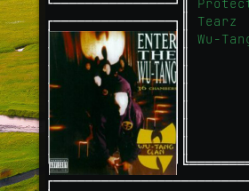
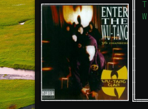

## Table Of Contents

* [Configuration](#configuration)
	* [MPD Port](#mpd-port)
	* [Music Directory](#music-directory)
	* [Default Image Path](#default-image-path)
	* [Additional Padding and Extra Image Width](#additional-padding-and-extra-image-width)
		* [Image Rendering](#image-rendering)
	* [Cache Directory](#cache-directory)
	* [Key Mappings](#key-mappings)
	* [Getting Album Art from LastFm API](#getting-album-art-from-lastfm-api)

# Configuration

Configuration of gomp is done through a `config.yml` file in `$HOME/config/gomp/`

It is essential to have some config options defined in order to have a smooth experience.

## MPD Port

This is the port where your Music Player Daemon Is Running

```yml
MPD_PORT : "6600"
```

## Music Directory

The Most Essential config option is `MUSIC_DIRECTORY` It is the path to your Music Folder that you have provided to mpd
in the `mpd.conf` file. If you do not provide the path to the `MUSIC_DIRECTORY` then gomp parses the mpd.conf file for
the `music_directory` option ( It is to be noted that gomp assumes that your mpd.conf file is at
`$HOME/.config/mpd/mpd.conf`

```yml
MUSIC_DIRECTORY : "~/Music"
```

The reason why you need to setup `MUSIC_DIRECTORY` manually because the paths to the songs received from mpd are relative the `MUSIC_DIRECTORY`.

## Default Image Path

This is the Fallback Image that will be rendered if gomp doesn't find the embedded cover art or LastFM Cover Art.

```yml
DEFAULT_IMAGE_PATH : "/path/to/default/image"
```

## Additional Padding and Extra Image Width

### Image Rendering

The Default Position of the Image without any configuration assumes that you have no font or terminal padding or margin so Image will
be rendered at different places in different terminals, Also the TUIs calculates positions with the respect to rows and columns
and the image is rendered at pixel positions so the exact position can't be defined [ the app tries its best by calculating
the font width and then predicting the position but it is best that you define some extra padding and your own image width ratio
in config.yml. Please Read more about it in the [sample_config](https://github.com/aditya-K2/gomp/blob/master/sample_config.yml)

for e.g

```yml
# Default Values. Might be different than sample_config.yml
ADDITIONAL_PADDING_X : 11
ADDITIONAL_PADDING_Y : 18

IMAGE_WIDTH_EXTRA_X  : -0.7
IMAGE_WIDTH_EXTRA_Y  : -2.6
```


Let's say upon opening gomp for the first time and your image is rendered this way.

Here the `Y` Position is too low hence we have to decrease the `ADDITIONAL_PADDING_Y` so that image will be rendered
in a better position so we decrement the  `ADDITIONAL_PADDING_Y` by `9`

Now the configuration becomes
```yml
ADDITIONAL_PADDING_Y : 9
```

and the image appears like this:


One might be happy the way things turn out but for the perfectionist like me this is not enough.
You can notice that the Height of the image is a little bit more than the box height and hence the image is flowing outside the box. Now it's  time to change the `WIDTH_Y`.

Width can be changed by defining the `IMAGE_WIDTH_EXTRA_Y` and `IMAGE_WIDTH_EXTRA_X` it act's a little differently think of it like a chunk which is either added or subtracted from the image's original width. We can look at the configuration and realize that the chunk `IMAGE_WIDTH_EXTRA_Y` when subtracted from the original `IMAGE_WIDTH` doesn't get us the proper result and is a little to low. We need to subtract a more bigger chunk, Hence we will increase the magnitude of `IMAGE_WIDTH_EXTRA_Y` or decrease `IMAGE_WIDTH_EXTRA_Y`

Now the Configuration becomes:
```yml
IMAGE_WIDTH_EXTRA_Y : - 3.2
```
and the image appears like this:



Which looks perfect. 🎉

Read More about Additional Padding and Image Width in the [sample_config](https://github.com/aditya-K2/gomp/blob/master/sample_config.yml)

Please change the configuration according to your needs.

## Cache Directory

By Default Images are cached to avoid re-extracting images and making redundant API Calls. The Extracted Images are copied to the `CACHE_DIR`.

```yml
CACHE_DIR : "/path/to/the/cache/Directory/"
```

Read More about Caching in the [sample_config](https://github.com/aditya-K2/gomp/blob/master/sample_config.yml)

## Key Mappings

Following Keys can be used for Mappings

| Keys            | Using them in Config  |
|-----------------|-----------------------|
| a-z             | a-z                   |
| A-Z             | A-z                   |
| {,},(,),[,],<,> | {,},(,),[,],<,>       |
| Enter(Return)   | ENTER/RETURN          |
| Tab             | TAB                   |
| Space           | SPACE                 |

See config/kMap.go for more information

For mapping a key to some function use the following format:


```yml
Function: [ firstMapping, secondMapping, thirdMapping]
```
for.eg


```yml
togglePlayBack : [ "p", "TAB", "[" ] # using the quotes is neccessary.
```

Following functions are provided :

|          Functions                 |
|------------------------------------|
|     showChildrenContent            |
|     togglePlayBack                 |
|     showParentContent              |
|     nextSong                       |
|     clearPlaylist                  |
|     previousSong                   |
|     addToPlaylist                  |
|     toggleRandom                   |
|     toggleRepeat                   |
|     decreaseVolume                 |
|     increaseVolume                 |
|     navigateToFiles                |
|     navigateToPlaylist             |
|     navigateToMostPlayed           |
|     navigateToSearch               |
|     quit                           |
|     stop                           |
|     updateDB                       |
|     deleteSongFromPlaylist         |
|     FocusSearch                    |

## Getting Album Art from [LastFm API](https://www.last.fm/api)

1. Generate API Key [here](https://www.last.fm/login?next=%2Fapi%2Faccount%2Fcreate%3F_pjax%3D%2523content)

   

2. Add the api key and api secret to config.yml

```yml
GET_COVER_ART_FROM_LAST_FM : "TRUE" # Turn On Getting Album art from lastfm api
LASTFM_API_KEY: "YOUR API KEY HERE"
LASTFM_API_SECRET: "YOUR API SECRET HERE"
```
3. Auto correct


```yml
LASTFM_AUTO_CORRECT: 1  # 0 means it is turned off
```
